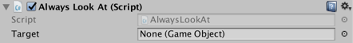
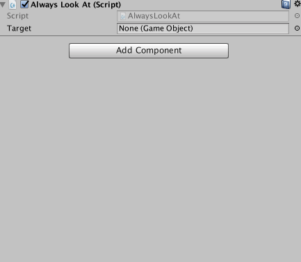

# Session 2
## Fields

Fields are bits of data that components carry around. Add the line

```cs
public GameObject target;
```

just after the class declaration so that the code now looks like this:

```cs
using System.Collections;
using System.Collections.Generic;
using UnityEngine;

public class AlwaysLookAt : MonoBehaviour {
    public GameObject target;

    // Use this for initialization
    void Start () {

    }

    // Update is called once per frame
    void Update () {

    }
}
```

Save the file and jump back into Unity. You should see that field show up in the inspector for the AlwaysLookAt component!



### Syntax

#### `public`
There's public again. We're telling C# that anyone can see and manipulate this field. This is what allows it to show up in the inspector. Try changing this to `private` or removing it altogether (`private` is the default), save the file, and see what happens in the inspector.

#### `GameObject`
Here, we're specifying the *type* of the field. Recall that C# is statically typed, meaning we need to announce the kind of data we're manipulating at all times. So this field can store a `GameObject`.

#### `target`
This is the name of the field. We see it in the inspector, and this is the name we will use for it in our code. Note that the name as it appears in the inspector (capitalized) is a convenience, and shouldn't be used in code.

### Assigning Values
As you can see in the inspector, the default value is `None`, meaning that `target`'s value is `null`. We want `target` to refer to the `Player` GameObject in the scene so that the next bit of our code can use it. You can give it a value in one of two ways: clicking the little circle on the right brings up a browsable list of all available GameObjects in the project and scene.



Or, the Player object can be dragged in from the Hierarchy.


