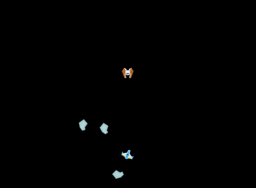

# Session 2

Students begin writing code to add an enemy to the game. For this session, we will add the enemy, and cause it to follow the player.



## Goals
- Understand the difference between C# and Unity
- Experience first exposure to code
- Make a digital enemy that follows the player around
- Understand basic linear algebra as its needed by games

## New Code
By the end of the session, you will have written the following script:

```cs
using UnityEngine;
using System.Collections;

public class AlwaysLookAt : MonoBehaviour {
  public GameObject target;

  void Update () {
    transform.up = target.transform.position - transform.position;
  }
}
```
