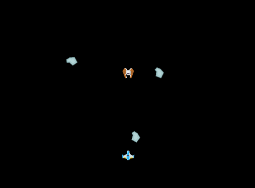

# Session 3

Students make the Enemy respond to collision with the player's bullets by disappearing.




## Goals
* Begin to understand Unity's physics engine
* Make multiple components work together

## New Code
By the end of the session, you will have written the following script:

```cs
using System.Collections;
using System.Collections.Generic;
using UnityEngine;

public class DestroySelfOnCollision : MonoBehaviour
{
	public string otherTag;

	void OnTriggerEnter2D(Collider2D otherCollider)
	{
		if (otherCollider.gameObject.tag == otherTag)
		{
			Destroy(gameObject);
		}
	}
}
```
