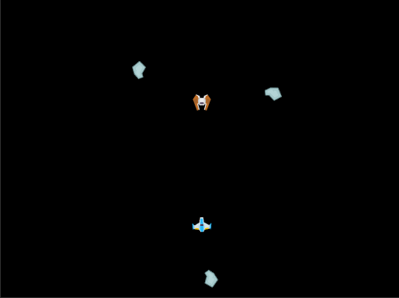

# Session 4

Students make the Enemy shoot back at the player.



## Goals
* Understand timers
* Understand prefabs
* Make multiple components work together

## New Code
By the end of the session, you will have written the following script:

```cs
using System.Collections;
using System.Collections.Generic;
using UnityEngine;

public class CloneOnTimer : MonoBehaviour {
	public float timeBetweenClones = 5;
	public float counter;
	public GameObject clone;
	public Vector2 offset;

	void Start()
	{
		counter = timeBetweenClones;
	}

	void Update () {
		counter = counter - Time.deltaTime;
		if (clone && counter <= 0)
		{
			counter = timeBetweenClones;
			Instantiate(clone, transform.position + transform.TransformDirection(new Vector3(offset.x, offset.y, 0)), transform.rotation);
		}
	}
}
```
