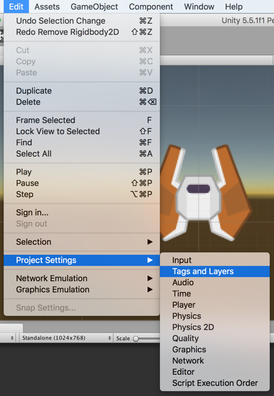
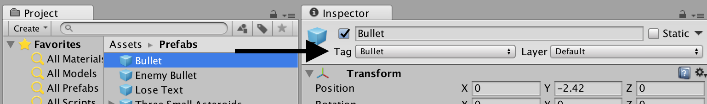

# Session 3
## Tags
There are a few ways to restrict collision between objects. [Layers](https://docs.unity3d.com/Manual/Layers.html) are option, but we're going to use [tags](https://docs.unity3d.com/Manual/Tags.html) in this lesson.

Tags are a way of grouping GameObjects. The GameObjects may have different names, components, places in the scene, but if they all share the same tag we can check for it and treat them all the same way. A tag is a string, but you have to tell Unity about all your tags beforehand.

### Adding a Tag

Open the Tags and Layers window and observe that we've already added a "Bullet" tag. Also observe that the bullet prefab is already using it. When making your own tags, these are the places in the UI where you would add new ones and associate them with GameObjects. No additional action is needed for this lesson, however.





### Checking for a Tag

Lead your class to make the following changes to the component:

1. Add a public field of type string named `otherTag`
2. Check if the object collided with has the tag `otherTag` before destroying

The code should look like

```cs
using System.Collections;
using System.Collections.Generic;
using UnityEngine;

public class DestroySelfOnCollision : MonoBehaviour
{
	public string otherTag;

	void OnCollisionEnter2D(Collision2D collision)
	{
		if (collision.gameObject.tag == otherTag)
		{
			Destroy(gameObject);
		}
	}
}
```

### Explanation
We are using a field as [before](fields.md), and a value of "Bullet" should be provided in the inspector.

We then access the `collision` object to query the GameObject that was just collided with, and then finally that GameObject's tag, and we check to see if it is equal to the value of `otherTag`. Only if that is true do we destroy the GameObject.

One way to read this in English is "We just collided with something (`collision`). Which GameObject was it (`collision.gameObject`)? What was its tag (`collision.gameObject.tag`)? Was that tag equal to the value we set `otherTag` to (`collision.gameObject.tag == otherTag`)? If so, destroy our GameObject."


### Experiments
1. Try assigning different values to `otherTag` in the inspector
2. Try `!=` instead of `==`
