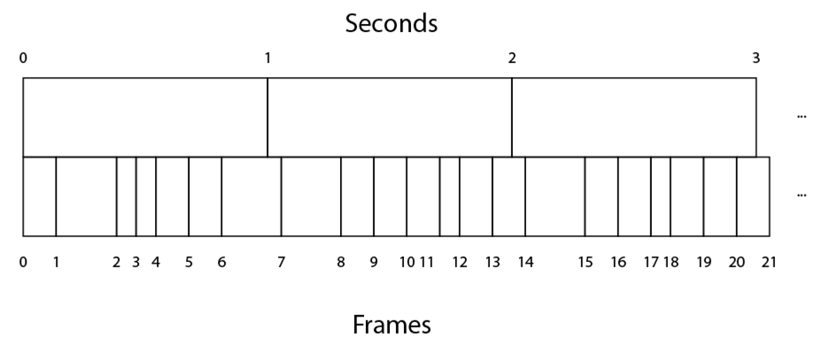

# Session 4
## Timers

The first task is to make the bullets fire more slowly, or more specifically, to have control over the rate at which they spawn. The challenge is to bridge the fact that Unity's `Update` message is sent *once* every frame, but we want to clone a bullet *once every certain number of seconds*. That is, we have to bridge the notion of *frames* with the notion of *seconds*. This has always been a confusing subject for students! So make sure to allow for ample tome to cover it.

### Frames
Unity creates the illusion of motion on a screen by generating many images and displaying them after each other. This is a lot like the way a movie works, except that Unity can react to a player's input and generate totally new content every time. One of these images that gets generated is called a *frame*.

The conceptual leap is that frames happen *very* fast, around sixty per second, but we tend to think of time in terms of seconds. There is no easy way to write code that runs once a second (Unity's [coroutines](https://docs.unity3d.com/Manual/Coroutines.html) can actually do this, but they're a bit advanced for a first workshop), so your code tends to be invoked once a frame. To complicate thing further, frames don't all take the same amount of time. More action and computation might cause one frame to take longer than another one.

A diagram approximating this reality is often helpful.



Demonstrate that many frames happen in one second, that they don't line up with seconds at all, and that they take a different amount of time. Note that this diagram illustrates around seven frames per second to save space, when Unity will actually run closer to sixty frames pre second.

This explains why so many bullets were being spawned in the earlier exercise. Our `Update` code was being called once a frame, so by the time a second had passed we had `Instantiate`d around sixty bullets!

### Delta Time
To convert between frames and seconds, Unity provides us with [`Time.deltaTime`](https://docs.unity3d.com/ScriptReference/Time-deltaTime.html), the number of seconds it took to complete the last frame, and it usually a very small number. One way to think of `Time.deltaTime` is as a measure of how many seconds make up a single frame. Frames per second is a common measure of how fast a game is running, and `Time.deltaTime` is its inverse.

The official Unity tutorial does a decent job of covering the concept.

<iframe width="560" height="315" src="https://www.youtube.com/embed/a-w7w8x_moE" frameborder="0" allowfullscreen></iframe>

### Slower Bullets

We're going to clone our bullet only after a certain number of seconds has passed. There are a few ways to do this in Unity, but the approach taken here is the following:

1. Specify how many seconds to wait between between clones. (e.g 5 seconds)
2. Maintain a counter variable that initially has the same value as the number of seconds to wait between clones (e.g. 5 seconds)
3. Every frame, subtract `Time.deltaTime` from the counter
4. If the counter is less than zero, reset the counter and clone the bullet as before

Guide your students to write the following script:

```cs
using System.Collections;
using System.Collections.Generic;
using UnityEngine;

public class CloneOnTimer : MonoBehaviour
{
	public float timeBetweenClones = 5;
	public float counter;
	public GameObject clone;

	void Start()
	{
		counter = timeBetweenClones;
	}

	void Update()
	{
		counter = counter - Time.deltaTime;
		if (counter <= 0)
		{
			counter = timeBetweenClones;
			Instantiate(clone, transform.position, transform.rotation);
		}
	}
}
```

### Explanation
Use the fact that all variables are public to watch their values change while the game is playing. Watching `counter` decrease slowly can be particularly helpful.

#### `timeBetweenClones = 5;`
The fields are largely the same, except that `timeBetweenClones` has a `= 5` after it. This means that the *default value* for new `CloneOnTimer` components will be 5. Unity will always use the value in the inspector, however, so changing the value there will override this.

#### `void Start ()`
In addition to `Update`, we need to run some logic to set things up. `Start` runs only once at the start of a game, and in here sets `counter` to have the same value as `timeBetweenClones`
