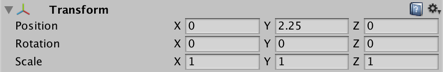
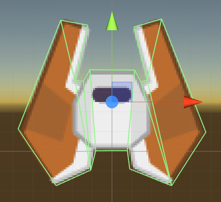
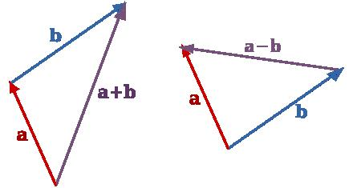

# Session 2
## Turning Logic

Now that the `target` field has a value, making the enemy turn to face it is a single line of code, but that line is quite dense. Add

```cs
transform.up = target.transform.position - transform.position;
```

to the Update method, such that the code now looks like:

```cs
using System.Collections;
using System.Collections.Generic;
using UnityEngine;

public class AlwaysLookAt : MonoBehaviour {
    public GameObject target;

    // Use this for initialization
    void Start () {

    }

    // Update is called once per frame
    void Update () {
      transform.up = target.transform.position - transform.position;
    }
}
```

Hit play in Unity and the enemy should start looking at the player!

### Explanation
One way to read this line of code is "set the *up* direction of this GameObject to be the difference between the *target's position* and *this GameObject's position*". To understand that, we need to talk about the Transform component and some linear algebra

#### The Transform Component


Every GameObject in Unity gets a [Transform component](https://docs.unity3d.com/ScriptReference/Transform.html). It stores the position, rotation, and scale of the GameObject, and enables the nesting of GameObjects (it keeps track of children and parents). It's so important to Unity that you can't even remove it!

Since the Transform component controls rotation, if we want our `AlwaysLookAt` component to rotate the GameObject it has to talk to the Transform component. There are a few ways to do this, including the [`Rotate`](https://docs.unity3d.com/ScriptReference/Transform.Rotate.html) method, or setting the [`rotation`](https://docs.unity3d.com/ScriptReference/Transform-rotation.html) or [`eulerAngles`](https://docs.unity3d.com/ScriptReference/Transform-eulerAngles.html) properties.

For the purposes of this script, however, the easiest thing to do is to *set the [`up`](https://docs.unity3d.com/ScriptReference/Transform-up.html) property*. The `up` property corresponds to the green axis as seen in the scene view.



It is a vector, so it is an indication of direction. Assigning it a new value will rotate the object so that the green arrow is facing this new direction. Since our green arrow lines up with the front of the enemy, this causes the enemy to turn and "face" in that new direction!

##### Syntax
The `.` operator is the *member access* operator. You can read `transform.up` as "get the thing called `up` from inside the `transform` object". Here, `transform` is shorthand for `this.transform`, which in turn is shorthand for `this.gameObject.transform`. [`this`](https://msdn.microsoft.com/en-us/library/dk1507sz.aspx) is a special keyword in C# that refers to the *current* object that your code is running on, in this case the `AlwaysLookAt` component. The [`gameObject`](https://docs.unity3d.com/ScriptReference/Component-gameObject.html) field refers to the GameObject the component is attached to, and the `transform` field refers to the Transform component attached to that GameObject. So, `transform.up` can be read as "get the `up` property of the Transform component attached to the same GameObject as me" from the perspective of the `AlwaysLookAt` component.

Assigning a new value is done with the `=` operator, which assigns the result of the expression on the right of the `=` symbol to whatever is on the left of the `=` symbol. `transform.up = target.transform.position - transform.position;` can be read as "Assign to the up property of the Transform component attached to the same GameObject as me the result of `target.transform.position - transform.position`".

We are subtracting two values, `target.transform.position` and `transform.position`. Both are accessing the [`position`](https://docs.unity3d.com/ScriptReference/Transform-position.html) property of Transform components, but they're accessing them on different GameObjects. Recall that `target` is a field that we set up that was of type `GameObject` and we associated it with the Player's GameObject. When we say `target.transform.position`, we're accessing the position property of the Transform component attached to the GameObject associated with `target`, in this case the Player. When we say `transform.position`, we are using the same shorthands mentioned above to access the position property on the Transform component of the GameObject this component is attached to. So we are subtracting the position of the GameObject `AlwaysLookAt` is attached to (the enemy) from the position of the `target` (the player).

But what does subtracting positions give us?

#### Linear Algebra
In addition to logic, certain kinds of math are unavoidable in game development. Chief among them is *linear algebra*, the mathematics of vectors, matrices, and space. Using the fact that points in space can be interpreted as vectors from the origin to those points, we can see below on the right that subtracting two points gives us *a vector pointing from one to the other*.


> *From http://www.askiitians.com/iit-jee-physics/general-physics/addition-and-subtraction-of-vectors.aspx*

Imagine that the enemy GameObject is at *b* in the above example, and the Player is at *a*. Subtracting their positions gives us the vector to look at in order for *b* to face *a*, for the enemy to face the player. If we set the green axis (`transform.up`) to this vector, the enemy will turn to align itself and appear to look at the player.

### Experiments
A good way to drive home abstract concepts like these is with miniature experiments. Try the following as a class, and discuss the differences you observe:

1. Replace the line of code in Update with
  1. `transform.up = transform.position - target.transform.position;`
  1. `transform.right = target.transform.position - transform.position;`
  1. `transform.up = -1 * (target.transform.position - transform.position);`
  1. `transform.up = Vector3.right`
1. In the inspector, associate different objects with `target`
